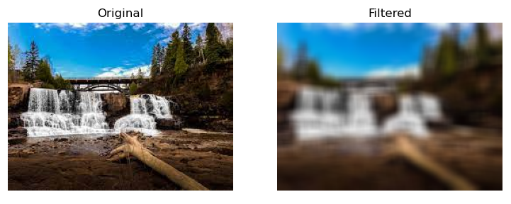
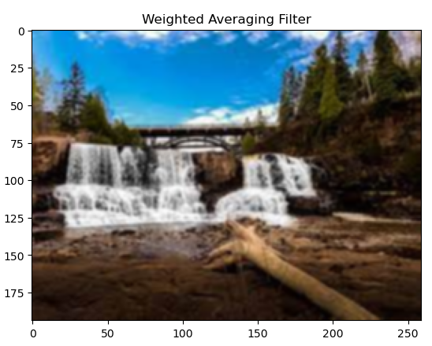
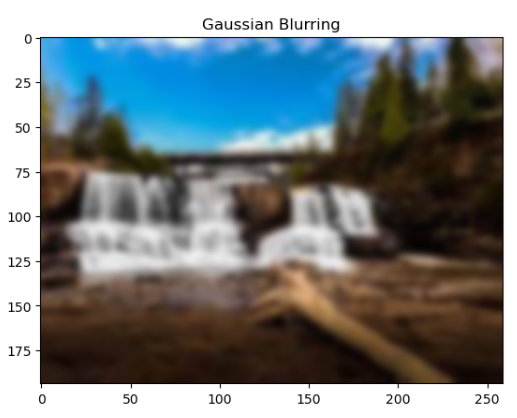
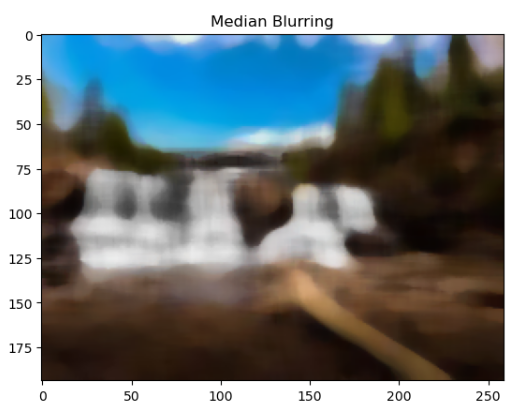
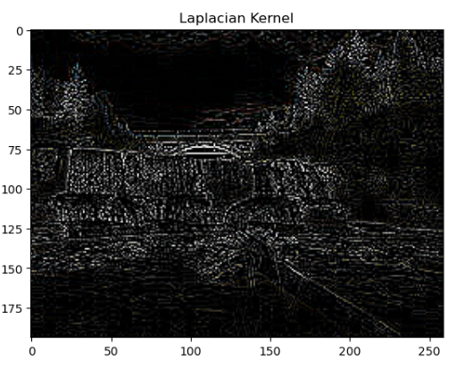
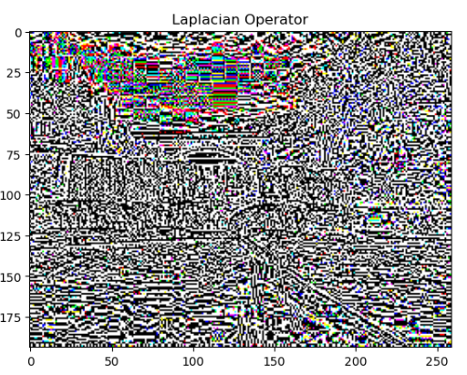

# Implementation-of-filter
## Aim:
To implement filters for smoothing and sharpening the images in the spatial domain.

## Software Required:
Anaconda - Python 3.7

## Algorithm:
### Step1
Import the necessary modules required, numpy, matplotlib and cv2
</br> 

### Step2
Read the image uploaded and convert them from BGR to RGB.
</br> 

### Step3
Apply Average filter techinque, Weighted Average filter techniques.    
</br> 

### Step4
Read the image and apply the Gaussian filtering technique by implementing the kernel size and sigma value of X and Y.
</br> 

### Step5
Similarly apply the same for the Median blurring technique.
</br> 

### Step6
For Sharpening Filtering apply the Lapalacian Kernel technique and Laplacian operator technique.
</br>

<br>

### Developed By   :    MEETHA PRABHU
### Register Number:212222240065
</br>

### 1. Smoothing Filters
```python
import cv2
import numpy as np
import matplotlib.pyplot as plt
image1=cv2.imread('flower.jpg')
image2=cv2.cvtColor(image1,cv2.COLOR_BGR2RGB)
kernel=np.ones((11,11),np.float32)/121
image3=cv2.filter2D(image2,-1,kernel)

plt.figure(figsize=(9,9))
plt.subplot(1,2,1)
plt.imshow(image2)
plt.title('Original')
plt.axis('off')

plt.subplot(1,2,2)
plt.imshow(image3)
plt.title('Filtered')
plt.axis('off')
```
i) Using Averaging Filter
```Python
import cv2
import numpy as np
import matplotlib.pyplot as plt
image1=cv2.imread('flower.jpg')
image2=cv2.cvtColor(image1,cv2.COLOR_BGR2RGB)
kernel=np.ones((11,11),np.float32)/121
image3=cv2.filter2D(image2,-1,kernel)

plt.figure(figsize=(9,9))
plt.subplot(1,2,1)
plt.imshow(image2)
plt.title('Original')
plt.axis('off')

plt.subplot(1,2,2)
plt.imshow(image3)
plt.title('Filtered')
plt.axis('off')

```
ii) Using Weighted Averaging Filter
```Python
import cv2
import numpy as np
import matplotlib.pyplot as plt
image1=cv2.imread('flower.jpg')
image2=cv2.cvtColor(image1,cv2.COLOR_BGR2RGB)
kernel2=np.array([[1,2,1],[2,4,2],[1,2,1]])/16
image3=cv2.filter2D(image2,-1,kernel2)
plt.imshow(image3)
plt.title('Weighted Averaging Filter')
```
iii) Using Gaussian Filter
```Python
import cv2
import numpy as np
import matplotlib.pyplot as plt
image1=cv2.imread('flower.jpg')
image2=cv2.cvtColor(image1,cv2.COLOR_BGR2RGB)
gaussian_blur=cv2.GaussianBlur(src=image2,ksize=(11,11),sigmaX=0,sigmaY=0)
plt.imshow(gaussian_blur)
plt.title('Gaussian Blurring')
```

iv) Using Median Filter
```Python
import cv2
import numpy as np
import matplotlib.pyplot as plt
image1=cv2.imread('flower.jpg')
image2=cv2.cvtColor(image1,cv2.COLOR_BGR2RGB)
median=cv2.medianBlur(src=image2,ksize=11)
plt.imshow(median)
plt.title('Median Blurring')
```

### 2. Sharpening Filters
i) Using Laplacian Kernal
```Python
import cv2
import numpy as np
import matplotlib.pyplot as plt
image1=cv2.imread('flower.jpg')
image2=cv2.cvtColor(image1,cv2.COLOR_BGR2RGB)
kernel3=np.array([[0,1,0],[1,-4,1],[0,1,0]])
image3=cv2.filter2D(image2,-1,kernel3)
plt.imshow(image3)
plt.title('Laplacian Kernel')

```
ii) Using Laplacian Operator
```Python
import cv2
import numpy as np
import matplotlib.pyplot as plt
image1=cv2.imread('flower.jpg')
image2=cv2.cvtColor(image1,cv2.COLOR_BGR2RGB)
new_image=cv2.Laplacian(image2,cv2.CV_64F)
plt.imshow(new_image)
plt.title('Laplacian Operator')

```

## OUTPUT:
### 1. Smoothing Filters
</br>

i) Using Averaging Filter
</br>
</br>
</br>
</br>

ii) Using Weighted Averaging Filter
</br>
</br>
</br>
</br>
</br>

iii) Using Gaussian Filter
</br>
</br>
</br>
</br>
</br>

iv) Using Median Filter
</br>
</br>
</br>
</br>
</br>

### 2. Sharpening Filters
</br>

i) Using Laplacian Kernal
</br>
</br>
</br>
</br>
</br>

ii) Using Laplacian Operator
</br>
</br>
</br>
</br>
</br>

## Result:
Thus the filters are designed for smoothing and sharpening the images in the spatial domain.
